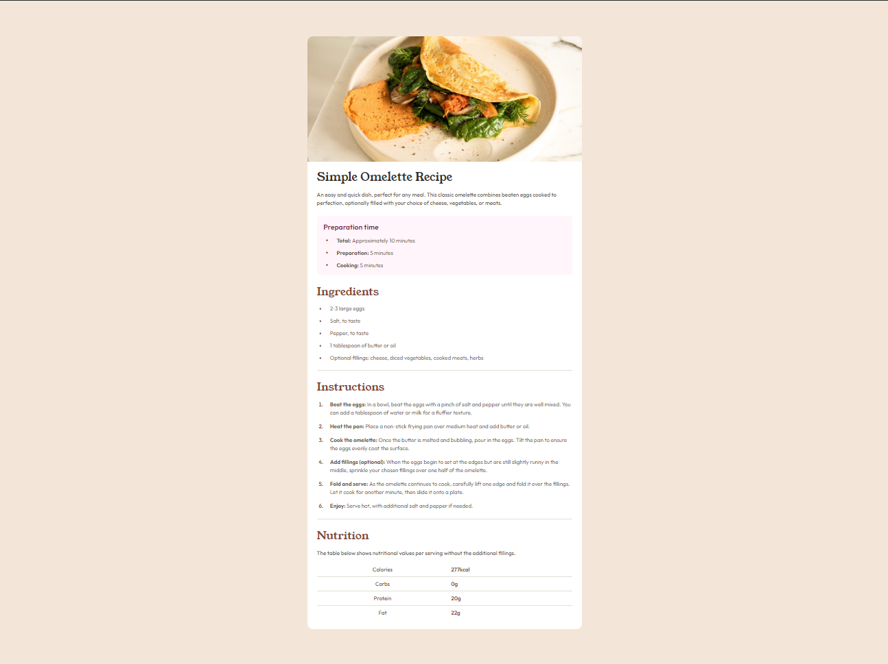

# Frontend Mentor - Recipe page solution

This is a solution to the [Recipe page challenge on Frontend Mentor](https://www.frontendmentor.io/challenges/recipe-page-KiTsR8QQKm).

## Table of contents

- [Overview](#overview)
  - [The challenge](#the-challenge)
  - [Screenshot](#screenshot)
  - [Links](#links)
- [My process](#my-process)
  - [Built with](#built-with)
  - [What I learned](#what-i-learned)
  - [Continued development](#continued-development)
- [Author](#author)

**Note: Delete this note and update the table of contents based on what sections you keep.**

## Overview

### The challenge

Your challenge is to build out this recipe page and get it looking as close to the design as possible.

You can use any tools you like to help you complete the challenge. So if you've got something you'd like to practice, feel free to give it a go.

### Screenshot



### Links

- Solution URL: [GitHub](https://github.com/TripCoder93/fm-recipe-page)
- Live Site URL: [Recipe Page](https://tripcoder93.github.io/fm-recipe-page/)

## My process

### Built with

- Semantic HTML5 markup
- CSS custom properties
- Flexbox
- CSS Grid
- Mobile-first workflow


### What I learned

I learned some new concepts like media queries, custom properties and change the default color of a "li" element. Also, I have to use some css functions to style the table

```css
@media only screen and (min-width: 800px) {
  main {
    display: grid;
    place-items: center;

    .card {
      margin: 2rem;
      border-radius: 1rem;
      max-width: 800px;

      img {
        border-top-left-radius: 1rem;
        border-top-right-radius: 1rem;
      }
    }
  }
}
```
```css
table {
  border-collapse: collapse;
  width: 100%;

  tr, td {
    padding: 0.5rem;
  }

  tr:not(:last-child) td {
    border-bottom: 1px solid var(--lightgray);
  }

  td:first-child {
    text-align: center;
    color: var(--wenge-brown);
    font-weight: 500;
    line-height: 24px;
    font-size: 1rem;
  }

  td:nth-child(2) {
    color: var(--nutmeg);
    font-weight: 600;
    line-height: 24px;
    font-size: 1rem;
  }
}
```

```css
.ingredients-container__items {
  display: inline-flex;
  flex-direction: column;
  margin-left: 0.4rem;
  gap: 1rem;
  list-style: none;

  li {
    position: relative;
    color: var(--wenge-brown);
    padding-left: 2rem;
    display: flex;
    align-items: center;
  }

  li::before {
    content: '•';
    position: absolute;
    left: 0;
    font-size: 24px;
    color: var(--nutmeg);
  }
}
```

### Continued development

I want to focus on have a better semantic html class names.


## Author

- GitHub - [TripCoder93](https://github.com/TripCoder93)
- Frontend Mentor - [@AndreCode2093](https://www.frontendmentor.io/profile/AndreCode2093)


